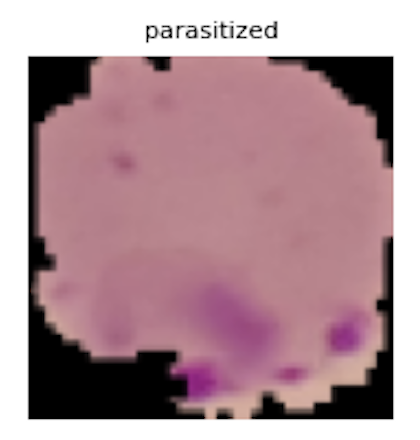
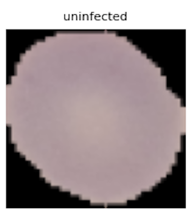
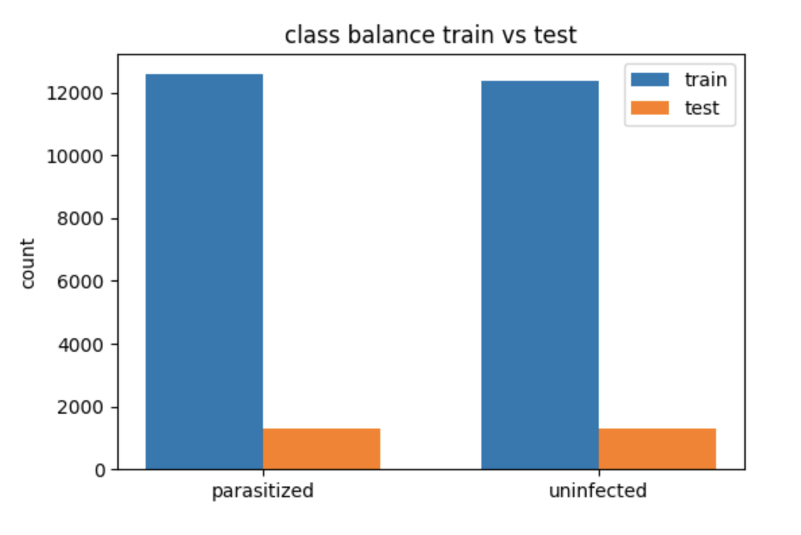
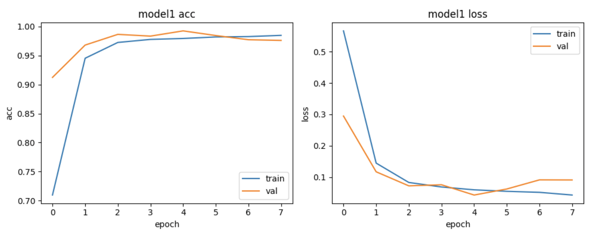
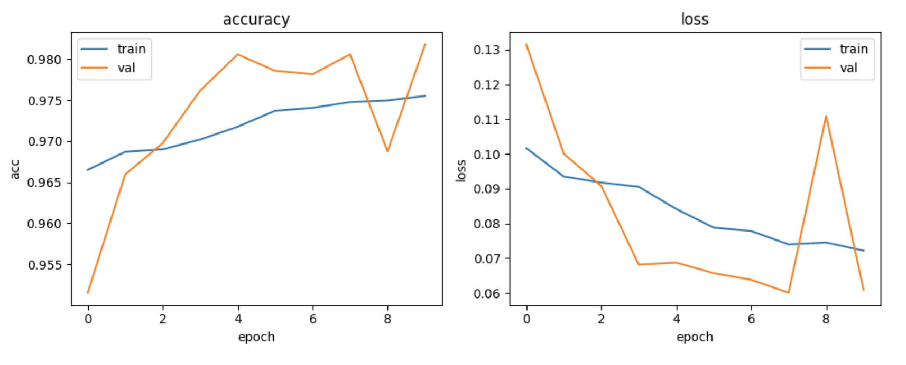
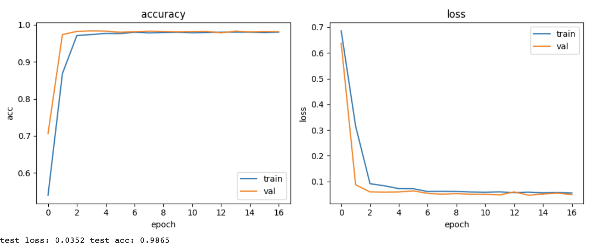
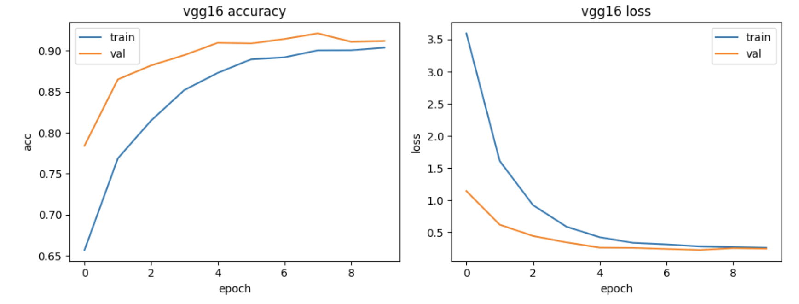
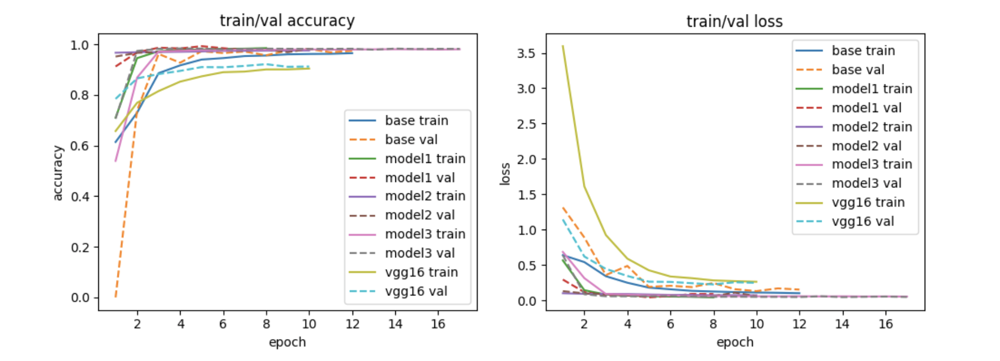
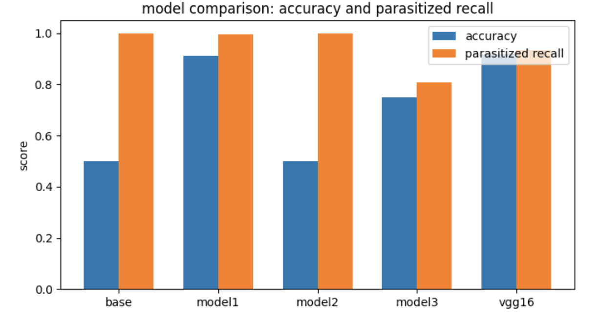

<p align="center">
  
</p>

# 🦠 Malaria Detection from Blood Cell Images using CNN

**Executive Summary**  
This project demonstrates how deep learning can accelerate malaria diagnosis by automatically classifying red blood cell images as **Parasitized** or **Uninfected**. Using ~27,500 labeled microscopy tiles, I benchmarked multiple CNN architectures and achieved **92% test accuracy** with a **VGG16 transfer learning model**, maintaining high recall (93%) for parasitized cells — a clinical priority. The pipeline is designed for **reproducibility, deployment feasibility, and ethical transparency**, with model cards, CLI inference, and GitHub Actions CI included. This work was completed as part of the **MIT Applied Data Science Program Capstone (Aug 2025)**.

---

## 📊 Dataset Overview

- **Source:** NIH Malaria Dataset (27,558 thin smear RBC images)  
- **Splits:** ~24,958 train / 2,600 test images  
- **Classes:** Parasitized vs Uninfected  
- **Input:** 64×64×3 tiles  
- **Preprocessing:** RGB + HSV conversions, normalization, augmentation  

| Parasitized | Uninfected |
|-------------|------------|
|  |  |

**Class Balance:**  


---

## 🏗️ Models Trained

- **Base CNN**: baseline, mild overfitting mid-training  
- **Model 1**: deeper CNN, higher peak, earlier overfit  
- **Model 2**: BN + LeakyReLU, faster/smoother convergence  
- **Model 3**: augmentation, improved robustness on held-out test  
- **VGG16 Transfer Learning**: frozen backbone + dense head, fine-tuned top block  

---

## 📋 Results Summary

| Model       | Test Accuracy | Parasitized Recall | Precision | AUC (est.) | Notes |
|-------------|---------------|--------------------|-----------|------------|-------|
| Base CNN    | ~0.65         | ~0.55              | ~0.60     | ~0.70      | Baseline, mild overfit mid-training |
| Model 1     | ~0.93         | ~0.95              | ~0.92     | ~0.95      | Deeper CNN, higher peak, earlier overfit |
| Model 2     | ~0.94         | ~0.96              | ~0.93     | ~0.96      | BN + LeakyReLU, faster/smoother convergence |
| Model 3     | ~0.90         | ~0.80              | ~0.88     | ~0.88      | Augmented, more robust but lower recall |
| **VGG16**   | **0.92**      | **0.93**           | 0.90      | ~0.94      | Balanced precision/recall, best confusion matrix |

---

## 📈 Training Performance

### Individual Models
- Model 1:   
- Model 2:   
- Model 3:   
- VGG16: 

### All Models


---

## ✅ Evaluation Results

### Confusion Matrices
- Model 2:   
- Model 3:   
- VGG16: 

**All Models Comparison:**  


### ROC & Recall
  


---

## 🔌 Quick CLI Inference
```bash
python src/predict.py path/to/image.png
# or
MODEL_PATH=models/malaria_vgg16.h5 python src/predict.py path/to/image.png
```

## ⚙️ Reproducible Environment
```bash
python -m venv .venv && source .venv/bin/activate
pip install -r requirements-lock.txt
```

## 🛡️ CI
Minimal GitHub Actions workflow at `.github/workflows/ci.yml` runs ruff + smoke test.

## 📑 Model Card
See **MODEL_CARD.md**.

--

## 📁 Repository Structure

Malaria-Detection-CNN-Capstone/
│
├── README.md # Project overview and documentation
├── LICENSE # MIT license
├── .gitignore # Ignore rules (data, models, checkpoints)
├── requirements-lock.txt # Pinned Python dependencies
├── notebooks/
│ └── Capstone_Malaria_Detection.ipynb # Main notebook (EDA + training)
├── src/
│ ├── train_model.py # Training pipeline (placeholder/extendable)
│ └── predict.py # CLI inference script
├── models/
│ └── .gitkeep # Placeholder (trained models go here, e.g. malaria_vgg16.h5)
├── Images/ # Visuals for README and analysis
│ ├── Data_Balance_Checks.png
│ ├── Model1_Accuracy-Validation_Curves.png
│ ├── Model2_Accuracy-Validation_Curves.png
│ ├── Model3_Accuracy-Validation_Curves.png
│ ├── VGG16model_Accuracy-Validation_Curves.png
│ ├── AllComparison_Accuracy-Validation_Curves.png
│ ├── Model2_ConfusionMatrix.png
│ ├── Model3_ConfusionMatrix.png
│ ├── VGG16model_ConfusionMatrix.png
│ ├── AllComparison_ConfusionMatrix.png
│ ├── AllComparison_ROC_Curve.png
│ └── AllComparison_Recall.png
├── .github/
│ └── workflows/
│ └── ci.yml # GitHub Actions workflow (lint + smoke test)
└── MODEL_CARD.md # Documentation of data, metrics, risks, ethics

--
## 🚀 How to Run
1. Install requirements:
```bash
pip install -r requirements.txt
```
2. Run the notebook:
```bash
open notebooks/Capstone_Malaria_Detection.html
```

## 📦 Dataset
Download from [Kaggle](https://www.kaggle.com/datasets/iarunava/cell-images-for-detecting-malaria) if not included.

## 👩‍🔬 Author
Gabrielle Foster – [LinkedIn](https://www.linkedin.com/in/gabriellefoster)
